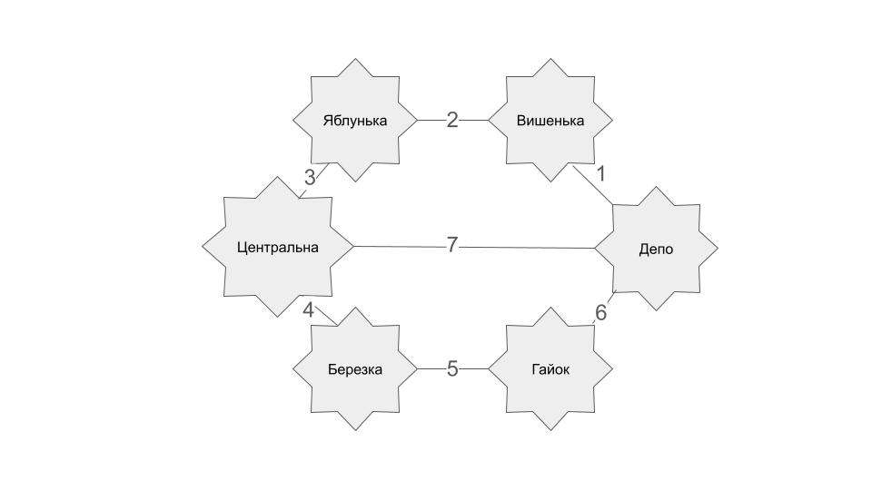

# Графи

Привіт! Як настрiй? Налаштовані на роботу з графами? 😉

Графи є потужним інструментом для моделювання та аналізу різноманітних систем і мереж в інформатиці. У цьому домашньому завданні ви зможете зрозуміти основні концепції графів, використовуючи бібліотеку networkX у Python, та реалізувати ключові алгоритми для роботи з графами. Згодом ви зможете використовувати ці навички для розв’язання завдань у реальних системах, де взаємодія та зв'язок є ключовими аспектами.

Що саме будете робити?

- потренуєтесь працювати з бібліотекою `networkX` — виконаєте побудову та аналіз графа;
- освоїте пошук у глибину `(DFS)` і пошук у ширину `(BFS)` та виконаєте програмну реалізацію цих методів;
- реалізуєте алгоритм Дейкстри для пошуку найкоротшого шляху у графі.
- Домашнє завдання буде складатися з трьох залежних завдань.

## Опис домашнього завдання

### Завдання 1

Створіть граф за допомогою бібліотеки `networkX` для моделювання певної реальної мережі (наприклад, транспортної мережі міста, соціальної мережі, інтернет-топології).

> INFO
>
> 📖 Реальну мережу можна вибрати на свій розсуд, якщо немає можливості придумати свою мережу, наближену до реальності.

Візуалізуйте створений граф, проведіть аналіз основних характеристик (наприклад, кількість вершин та ребер, ступінь вершин).

### Завдання 2

Напишіть програму, яка використовує алгоритми `DFS` і `BFS` для знаходження шляхів у графі, який було розроблено у першому завданні.

Далі порівняйте результати виконання обох алгоритмів для цього графа, висвітлить різницю в отриманих шляхах. Поясніть, чому шляхи для алгоритмів саме такі.

### Завдання 3

Реалізуйте алгоритм Дейкстри для знаходження найкоротшого шляху в розробленому графі: додайте у граф ваги до ребер та знайдіть найкоротший шлях між всіма вершинами графа.

## Підготовка та завантаження домашнього завдання

1. Створіть публічний репозиторій `goit-algo-hw-06`.
2. Виконайте завдання та відправте його у свій репозиторій.
3. Завантажте робочі файли на свій комп’ютер та прикріпіть їх у `LMS` у форматі `zip`. Назва архіву повинна бути у форматі `ДЗ6_ПІБ`.
4. Прикріпіть посилання на репозиторій `goit-algo-hw-06` та відправте на перевірку.

## Формат здачі

- Прикріплені файли репозиторію у форматі `zip` з назвою `ДЗ6_ПІБ`.
- Посилання на репозиторій.

## Критерії прийняття ДЗ

Прикріплені посилання на репозиторій `goit-algo-hw-06` та безпосередньо самі файли репозиторію у форматі `zip`.

### Завдання 1:

Створено та візуалізовано граф — модель певної реальної мережі.

Проведено аналіз основних характеристик.

### Завдання 2:

Програмно реалізовано алгоритми `DFS` і `BFS` для знаходження шляхів у графі, який було розроблено у першому завданні.

Здійснено порівняння результатів алгоритмів для цього графа, пояснено різницю в отриманих шляхах. Обґрунтовано, чому шляхи для алгоритмів саме такі.

Висновки оформлено у вигляді файлу `readme.md` домашнього завдання.

### Завдання 3:

У граф додано ваги ребер, програмно реалізовано алгоритм Дейкстри для знаходження найкоротшого шляху в розробленому графі.

## Висновки

### Завдання 1:

Ми проаналізували карту дитячої залізниці і отримали цікаві результати. Всього у нас є 6 станцій, з'єднаних між собою 7 коліями. Більшість станцій мають по два з'єднання, тобто є звичайними зупинками на лінії. Але є й дві важливі станції – "Депо" та "Центральна", з яких відходить по три колії. Це означає, що саме на цих станціях можна пересісти на інші маршрути.

### Завдання 2:

Було проведено експеримент з використанням алгоритмів DFS та BFS на графі, що моделює дитячу залізницю. Отримані результати демонструють, що для лінійних графів без циклів обидва алгоритми знаходять однаковий шлях між двома довільними вершинами. Це пояснюється лінійною структурою графу, яка не передбачає альтернативних шляхів.
